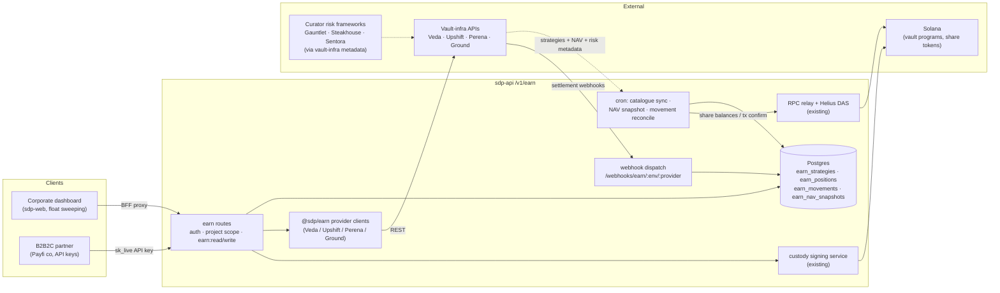
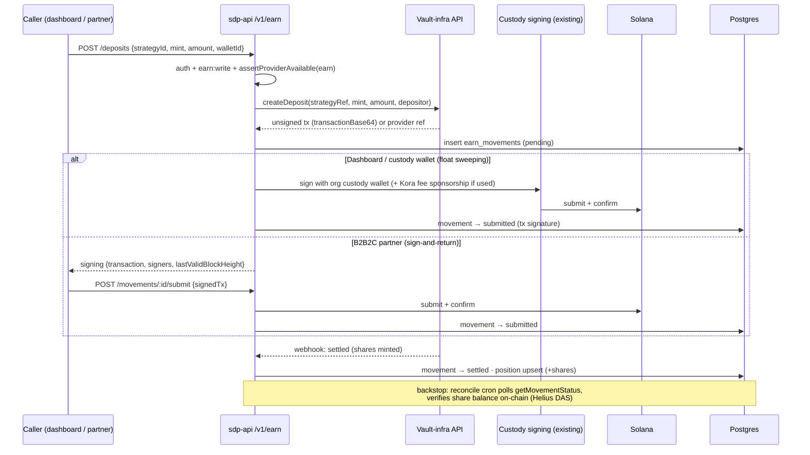

# Earn V1 — data flow & SDP reuse map

Companion to [ADR 0002](../decisions/0002-earn-provider-pluggability.md). The
scaffold on `earn-initial` shows the *shape*; this doc shows where every piece
of data comes from **in the real build**, and which existing SDP components
Earn rides on instead of rebuilding. Rule of thumb: **Earn adds a domain, not
a platform** — auth, tenancy, custody, signing, fees, RPC, webhooks, cron,
compliance, policies, and audit all already exist and are reused.

## System context

## Where each surface gets its data (source of truth)

| Surface | Serving read | Fed by | Freshness |
|---|---|---|---|
| Strategy catalogue | `earn_strategies` (DB) | Cron sync ← provider `listStrategies` (curator/risk metadata rides along as `risk_metadata`) | Sync cadence (e.g. hourly) + on-demand refresh |
| APY / NAV / TVL | `earn_nav_snapshots` (DB time series) | NAV cron ← provider `getNav` **and/or** on-chain share-price read via RPC relay (open decision below) | Cron cadence (e.g. 15m) |
| Positions | `earn_positions` (DB ledger) | Written by execution path; **verified** against on-chain share-token balances via Helius DAS / RPC (reconciliation cron) | Ledger = immediate; reconcile = cron |
| Deposits/withdrawals | `earn_movements` (DB ledger) | Execution endpoints write `pending`; settled via provider webhook (primary) + status-poll cron (backstop) — same ack-then-reconcile shape as ramps | Webhook ≈ real-time |
| Quotes (rate previews) | Live passthrough | Provider `quoteDeposit`/`quoteWithdrawal`, no DB | Real-time |
| Wallet balances (funding) | Existing wallet/custody surfaces | Existing RPC relay + token account reads — nothing Earn-specific | Existing behavior |
| Provider on/off state | `getProviderAvailability` (existing service, `earn` family already wired) | Org entitlements + env credentials | Real-time |

**No new indexer.** V1 needs no event-sourced chain indexer: catalogue and NAV
come from provider APIs (optionally cross-checked on-chain), and position truth
is SDP's own ledger reconciled against token balances the existing Helius DAS
service can already read. If V2 needs richer on-chain history (per-block share
price, protocol events), that's the point to evaluate an indexer — not V1.

## Deposit execution (the real thing)

Withdrawals mirror this with the liquidity-term fork: instant → same-loop
settlement; delayed → movement holds `redemption_available_at`, surfaces as a
pending redemption, settles on the provider's T+n webhook (or poll).

## Existing SDP we leverage (build ≠ rebuild)

| Existing component | Where | Earn uses it for | Status |
|---|---|---|---|
| Auth + API keys + permissions | `middleware/auth.ts`, `@sdp/types/permissions` | `earn:read`/`earn:write` gating, partner `sk_live` access | ✅ wired in scaffold |
| Org/project tenancy | `projectContextMiddleware` | Position/movement scoping | ✅ wired |
| Provider entitlements | `services/provider-availability.service.ts` | Per-org enable/disable, env kill-switch, exit-safe gate | ✅ wired (`earn` family) |
| Custody + signing | `services/domain/signing.service.ts`, `@sdp/custody` | Signing deposits/withdrawals from org wallets | 🔨 execution phase — extend `SigningMetadata.operationType` (closed union at `packages/sdp-custody/src/signing.ts:99`) with earn ops |
| Fee sponsorship | `@sdp/payments/fee-payment` (Kora) | Sponsored fees on earn txs (same as payments) | 🔨 execution phase |
| RPC relay (org-selected providers) | `@sdp/rpc` (`packages/sdp-rpc/src/relay.ts`) | On-chain reads: share balances, tx confirmation, optional NAV cross-check | 🔨 NAV/reconcile phase |
| Helius DAS | `services/helius-das.service.ts` | Share-token balance reads for position reconciliation (the "indexer-lite") | 🔨 reconcile phase |
| Webhook dispatch + signature verify | `routes/webhooks/handlers.ts`, `lib/webhook-signature.ts` | Provider settlement events (`EarnSettlementEvent`, mirrors `RampSettlementEvent`) | 🔨 per-provider processors |
| Cron infra (3 entrypoints) | `cron/runner.ts`, `index.ts scheduled`, `job.ts`; precedent `cron/pending-transfers.ts` | Catalogue sync, NAV snapshots, movement reconciliation | 🔨 net-new tasks on existing rails |
| Idempotency | `middleware/idempotency-key.ts` + `earn_movements.external_id` unique index | Partner-safe deposit/withdraw retries | ✅ schema ready |
| Compliance providers | `services/compliance/`, compliance family | RWA strategy KYC / depositor checks (open decision) | ⏸ decision pending |
| Policies + approvals | policy/approval domains (`policy.repository`, approvals UI) | Graft point for doc's risk tooling (whitelists, buffers, limits, timelocks, maker-checker) | ⏸ the audit's flagged gap — decide V1 vs later |
| Audit log | `services/audit.service.ts` | Deposit/withdraw/config audit events | 🔨 execution phase |
| Secrets/env plumbing | Doppler → `secret-keys.mjs` → workers | Provider API keys (already registered) | ✅ wired |
| OpenAPI → docs pipeline | `openapi/spec.ts` → sdp-docs | Public `/v1/earn` reference when flag flips | ⏸ deliberately deferred |

**Net-new (Earn-only) components:** the four provider HTTP clients in
`@sdp/earn`, catalogue-sync + NAV cron tasks, earn webhook processors, the
execution endpoints + `/movements/:id/submit`, and the dashboard's swap from
mock fixtures to the BFF (single seam: `earn-mock-data.ts`).

## Open infra decisions (mirror of the V1 decision list)

1. **NAV source of truth** — provider API (simple, trusts partner) vs on-chain
   share-price read via RPC relay (trustless, needs per-vault program
   knowledge) vs both with drift alerting. Cadence + retention for snapshots.
2. **Settlement signal** — webhook-primary with poll backstop (ramps pattern,
   assumed above) vs poll-only for providers without webhooks.
3. **Compliance hook** — do RWA deposits require a compliance-provider check
   (Genius-compliant tokens need app whitelisting — JOLT/B-reserves)?
4. **Policy engine scope** — which of whitelist/buffer/limits/timelocks land in
   V1, and whether they graft onto the existing policy/approvals domain.
