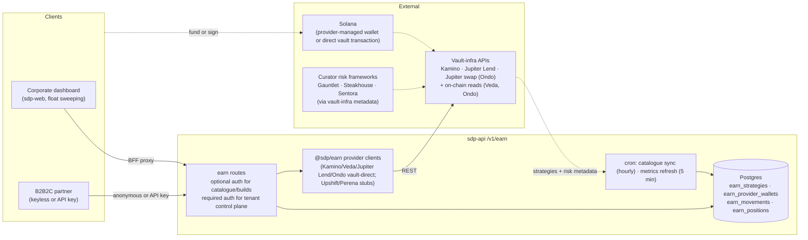

# Earn V1 — data flow & SDP reuse map

Companion to [ADR 0002](../decisions/0002-earn-provider-pluggability.md). The
scaffold on `earn-initial` shows the *shape*; this doc shows where every piece
of data comes from **in the real build**, and which existing SDP components
Earn rides on instead of rebuilding. Rule of thumb: **Earn adds a domain, not
a platform** — auth, tenancy, custody, signing, fees, RPC, webhooks, cron,
compliance, policies, and audit all already exist and are reused. For the
step-by-step of changing what Earn offers (provider / vault / category /
custodian), see the
[Earn pluggability playbook](../contributing/earn-pluggability-playbook.md).

## System context

```mermaid
flowchart LR
    subgraph Clients
        DASH["Corporate dashboard<br/>(sdp-web, float sweeping)"]
        PARTNER["B2B2C partner<br/>(keyless or API key)"]
    end

    subgraph SDP["sdp-api  /v1/earn"]
        ROUTES["earn routes<br/>optional auth for catalogue/builds<br/>required auth for tenant control plane"]
        SVC["@sdp/earn provider clients<br/>(Kamino/Veda/Jupiter Lend/Ondo vault-direct; Upshift/Perena stubs)"]
        DB[("Postgres<br/>earn_strategies · earn_provider_wallets<br/>earn_movements · earn_positions")]
        CRON["cron: catalogue sync (hourly) · metrics refresh (5 min)"]
    end

    subgraph External
        VAULT["Vault-infra APIs<br/>Kamino · Jupiter Lend · Jupiter swap (Ondo)<br/>+ on-chain reads (Veda, Ondo)"]
        CHAIN["Solana<br/>(provider-managed wallet or direct vault transaction)"]
        CURATOR["Curator risk frameworks<br/>Gauntlet · Steakhouse · Sentora<br/>(via vault-infra metadata)"]
    end

    DASH -->|BFF proxy| ROUTES
    PARTNER -->|anonymous or API key| ROUTES
    ROUTES --> DB
    ROUTES --> SVC
    SVC -->|REST| VAULT
    VAULT -.->|strategies + risk metadata| CRON
    CURATOR -.-> VAULT
    CRON --> DB
    Clients -.->|fund or sign| CHAIN
    CHAIN -.-> VAULT
```

Vault-direct execution has two signer surfaces over one provider runtime. The
treasury flow signs with an organization custody wallet. Embedded Yield returns
an unsigned transaction for an end-user wallet and, on keyed builds, an
optional partner fee payer to co-sign. Authenticated submits are recorded before
SDP broadcasts and converge through the vault-movement reconciler. Anonymous
builds are never persisted; the caller broadcasts and tracks them.

## Where each surface gets its data (source of truth)

| Surface | Serving read | Fed by | Freshness |
|---|---|---|---|
| Strategy catalogue | `earn_strategies` (DB) | Cron sync ← provider `listStrategies` (curator/risk metadata rides along as `risk_metadata`); snapshots outside the client's `declaredSupport` are skipped fail-closed (`isStrategyWithinDeclaredSupport`, `@sdp/earn/support`) | Hourly (`cron/earn-catalogue-sync.ts`) — identity, mints, liquidity terms and **admission** only |
| APY + vault TVL/holders | `earn_strategies.current_apy` / `risk_metadata` (DB) + live `getPortfolioYield` for the program-level rate | Metrics refresh ← provider `listStrategyMetrics` (`supportsLiveMetrics`); live provider read | **Every 5 min** (`cron/earn-metrics-refresh.ts`) / real-time |
| Whether a strategy is fundable *here* | Derived per request from `earn_strategies.host_cluster` vs the caller's environment — the `fundable` field on `GET /strategies` | `isClusterFundableInEnvironment` (`@sdp/earn`) | Real-time (never stored) |
| Keyless catalogue and unsigned builds | `GET /strategies`, `GET /strategies/:id`, deposit and withdrawal previews, and external-wallet transaction builders | Deployment `SDP_ENVIRONMENT`; no organization, project, entitlement, or persisted build context | Per request; catalogue responses may be publicly cached |
| Program list | `earn_provider_wallets` (**DB**, oldest first) joined per row with a **live provider snapshot** — `GET /v1/earn/programs` | Rows written by create; snapshots fetched in parallel per listed program | Real-time |
| Positions & balances | **Live provider snapshot** (`GET /v1/earn/programs/:programId` ← `getPortfolioWallet`) — never persisted | Provider | Real-time |
| Deposits | **Live provider** (`GET /programs/:programId/deposits` ← provider-observed on-chain deposits) — customer-initiated, so SDP has no intent moment to ledger | Provider | Real-time |
| Withdrawals (detail) | **Live provider** (`GET /programs/:programId/withdrawals/:ref`); the matching ledger row advances as a side effect | Provider | Real-time |
| Withdrawals (history/audit) | `earn_movements` (**DB ledger** — `GET /programs/:programId/withdrawals`) | Written at intent by `POST /programs/:programId/withdrawals`; advanced by guarded CAS on every observation (`services/earn-withdrawal-ledger.service.ts`) | Intent = immediate; status = each observation (+ ledger sweep) |
| Vault deposits (history/audit) | `earn_movements` (**DB ledger**; `GET /vault-deposits`, `GET /vault-deposits/:movementId`) | Written at intent BEFORE broadcast; detail reads observe the exact signature and advance the guarded row; the scheduled sweep supplies recovery | Intent = immediate; watched status follows chain finality on the next client poll; unattended recovery remains every minute |
| Vault holdings | `earn_positions` (**DB claim index**, never a balance) **hydrated live from chain** — `GET /vault-positions` | Claim written with the first durable signed intent; shares and value read live per request | Claim = immediate; value = real-time |
| Embedded Yield holdings + earnings | `earn_positions` scoped by org, project, environment, and owner, then hydrated live from chain; `GET /external-wallet/positions`, `/positions/summary`, `/earnings` | Claim written on the first submitted caller-signed movement; balances read from the owner's real on-chain shares | Claim = immediate; value = real-time |
| Embedded Yield activity | `earn_movements`; `GET /external-wallet/movements` + `/:movementId` | Caller-signed deposit and withdrawal submits, recorded before SDP broadcasts | Intent = immediate; detail polls chain finality and the background sweep recovers unattended rows |
| Movement history, ALL providers | `earn_movements` (**DB ledger** — `GET /v1/earn/movements`) | Every movement above, one chronological feed across both execution models; no provider gate (ADR 0002 exit safety) | Same as the rows it serves |
| Wallet balances (funding) | Existing wallet/custody surfaces | Existing RPC relay + token account reads — nothing Earn-specific | Existing behavior |
| Provider on/off state | `getProviderAvailability` (existing service, `earn` family already wired) | Org entitlements + env credentials | Real-time |

> **Ledger vs live.** SDP ledgers every movement it signs or accepts through a
> keyed external-wallet submit, while balances remain live provider or
> on-chain reads. Anonymous builds are not SDP movements and create no ledger
> row. A ledger row proves SDP's movement lifecycle, never the current balance.

> **Catalogue vs figures — split by how fast the thing moves (2026-08-13).**
> The catalogue row and the numbers on it now have different cadences and
> different writers. The hourly sync owns identity, mints, liquidity terms and
> ADMISSION; a five-minute refresh owns `current_apy` and volatile
> `risk_metadata`, and it is UPDATE-only — it cannot insert, so it can never
> admit a vault the catalogue gates refused, and its input type carries figures
> only, so it cannot change what a strategy is. This keeps rates quotable
> without breaking the one-source rule above: `GET /strategies` is still a plain
> DB read, and freshness comes from cadence rather than from blending a live
> overlay onto stored rows.
>
> **Catalogued ≠ fundable (2026-08-13; Kamino premise corrected 2026-08-14).**
> The catalogue may list instruments that do not exist on every cluster.
> Kamino was the original example — believed mainnet-only and catalogued into
> both environments — but it has a devnet deployment, and non-production now
> catalogues devnet vaults on its own lane. `host_cluster` states where the
> instrument lives, and the derived
> `fundable` answers the caller's actual question. Three gates read the one
> predicate — `assertKnownYieldSources` before any provider mutation, the wire
> field, and the dashboard's strategy filter.
>
> **Sandbox mirrors the mainnet shelf (2026-08-26, PRO-1742).** The sync's old
> refusal to STORE a `mainnet-beta` instrument outside production is now
> scoped to the OWN lanes: every non-production environment additionally
> carries a browse-only MIRROR of production's accepted mainnet shelf, written
> by the same single writer, delisted within its own cluster sub-shelf, and
> served only on an explicit `?cluster=` opt-in (the dashboard's sandbox-only
> toggle). Mirrored rows derive `fundable: false` and every provider mutation
> refuses them, so the gates above are unchanged: the curated mainnet
> catalogue became REVIEWABLE outside production, never fundable there. Full
> rationale, the collision cap, and the convergence rules: ADR 0002, PRO-1742
> addendum.

**No new indexer.** The catalogue comes from provider APIs or bounded on-chain
reads, and holdings are hydrated live. Vault-direct deposits and withdrawals
are ledgered when SDP signs them from custody or accepts them through a keyed
external-wallet submit. Anonymous unsigned builds remain outside the ledger.
Richer per-block history would be an indexer decision for a later product need.

## Execution era (PRO-1634 — arrived for `vault_direct`)

**This is now half true.** For the CUSTODIAL shape it still holds exactly: a
program is funded by sending stablecoins to its deposit address, with no
SDP-built transaction and no custody signing. (The Ground integration that used
this shape was removed; the routes and contracts stay provider-neutral.)

For the NON-CUSTODIAL (`vault_direct`) shape it no longer does. A K-Vault has no
address to send to, so the only way money moves is SDP building an instruction,
signing it with an organization custody wallet and submitting it. That path
exists: `@sdp/kamino` builds the plan, `POST /v1/earn/vault-deposits` signs and
submits, and `earn_movements` ledgers it — written at intent BEFORE signing,
because the chain has no request-id dedupe and a crash between signing and
recording is otherwise unrecoverable. `earn_positions` records only WHICH
(wallet, vault) pairs an org holds; shares and value stay live chain reads, so the
ledger-vs-live rule above is unchanged.

That ledger started as `earn_vault_movements` (migration 0059, *not* 0058 as this
document previously said) beside the custodial `earn_program_withdrawals` — two
authoritative tables split by execution mechanism. PRO-1705 merged them into one
`earn_movements` root and one `earn_positions` holdings table (migrations
0062-0065; ADR 0002 addendum 2026-08-19). The legacy tables still take the writes
and are mirrored into the unified shape in the same transaction until a later
release retires them, so the sources of truth in the table above are the unified
ones for every READ.

The withdraw counterpart landed with PRO-1702: `POST /v1/earn/vault-withdrawals`
records one share-mint-denominated signed movement before broadcasting it, and
the treasury dashboard's exit action drives it. The shared vault reconciliation
sweep finishes an ambiguous or interrupted submission. Vault deposits open
where the provider is DEPLOYED (`EARN_PROVIDER_DEPLOYED_CLUSTERS` in
`@sdp/types`, derived from each provider's program table and mapped through
`CLUSTER_BY_SDP_ENVIRONMENT`): Kamino from sandbox and production, Jupiter Lend
and Ondo from production only, Veda from sandbox until PRO-1777 fills its
mainnet deployment; the exit route itself takes no environment gate —
money out beats money off.

The removed pre-PRO-1634 execution sketch is not a contract. New providers must
implement today's `EarnVaultDirectProvider` plan and quote capabilities, then
inherit the shared treasury and external-wallet runtimes. Do not revive the old
per-provider movement endpoints or status polling types from git history.

## Existing SDP we leverage (build ≠ rebuild)

| Existing component | Where | Earn uses it for | Status |
|---|---|---|---|
| Auth + API keys + permissions | `lib/auth.ts`, `middleware/auth.ts`, `@sdp/types/permissions` | Optional identity enrichment for catalogue/previews/builds; an authenticated call retains that operation's `earn:read` or `earn:write` scope, while submits and tenant reads require authentication | ✅ two-tier router |
| Org/project tenancy | `projectContextMiddleware` | Authenticated program, build, movement, position, and withdrawal scoping. Anonymous requests receive no tenant context and write no tenant state. | ✅ wired |
| Provider entitlements | `services/provider-availability.service.ts` | Per-org enable/disable (override-only: every org needs an explicit `providerOverrides.earn.<id>`), env kill-switch, exit-safe gate | ✅ wired (`earn` family) |
| Custody + signing | `services/solana`, `@sdp/custody` | Treasury vault deposits and withdrawals sign provider-built instructions with the admitted organization wallet after policy enforcement | ✅ vault-direct treasury paths |
| Fee sponsorship | `@sdp/payments/fee-payment` (Kora), `services/earn/vault-sponsorship.ts` | Sign-only sponsorship of the network fee **and** share-ATA rent, resolved once per request and applied to the fee payer, the provider's `rentPayer` and the simulation payer together. The exit closes the share ATA and refunds its rent to whoever funded it: `earn_positions.share_ata_rent_funder` (0066), written by whichever movement in either direction actually created the account, or this exit's own rent payer when the exit creates it. Per cluster and off by default: a cluster sponsors when the flag is on AND the deployment has a Kora for it (`KORA_RPC_URL` for the `SOLANA_NETWORK` cluster, `KORA_RPC_URL_MAINNET` for the other); the movement's cluster selects the Kora, the budget network and the fee-pricing RPC. Deployed devnet carries the Earn ids on its Kora allowlist (sdp-infra#64, asserted by the `Kora / Live Smoke` shard on secret-bearing CI runs); mainnet additionally needs `allow_create_account` opened, `sbp_mainnet_global` enabled and its Kora wired (PRO-1738) | ✅ code · ✅ devnet deploy · ⏸ mainnet |
| Solana RPC | `@sdp/rpc`, `services/earn/execution-registry.ts` | Cluster-proved provider build, simulation, broadcast, and live vault-position hydration | ✅ vault-direct paths |
| Helius DAS | `services/helius-das.service.ts` | No V1 consumer; vault positions use direct RPC reads | ⏸ none in V1 |
| Webhook dispatch + signature verify | `routes/webhooks/handlers.ts`, `lib/webhook-signature.ts` | Provider settlement events land on the withdrawal ledger via the same applier the poll path uses (`earn-withdrawal-ledger.service.ts`) | ⏸ PRO-1631 (polling works today; the neutral event contract returns with it) |
| Cron infra (3 entrypoints) | `cron/runner.ts`, `index.ts scheduled`, `job.ts` | Catalogue sync, metrics refresh, withdrawal-ledger polling, and vault-movement reconciliation | ✅ wired and gated by the owning jobs |
| Idempotency | `middleware/idempotency-key.ts` + `lib/idempotency.ts` (derived request id, fingerprint replay) + `earn_program_withdrawals` (wallet, request_id) unique + `earn_provider_wallets` (provider, provider_wallet_ref) unique | Two-layer withdrawal retry safety: SDP intent row first, provider request-id dedupe as the crash-window backstop. Program **creation** is key-required too (PRO-1670) and derives against (org, environment, provider); the provider replays a retried create with the original wallet ref, so the global wallet-ref unique is what catches it — a violation there means "already created", answered 200, never 409 | ✅ wired (PRO-1628, PRO-1670) |
| Compliance providers | `services/compliance/`, compliance family | RWA strategy KYC / depositor checks (open decision) | ⏸ decision pending |
| Policies + approvals | policy/approval domains (`policy.repository`, approvals UI) | Treasury vault deposits and withdrawals emit `program` / `earn_vault_deposit` or `earn_vault_withdrawal`, enforce before custody, and fence approved retries against the signed intent; external-wallet authorization is the owner's signature | ✅ treasury vault writes |
| Audit log | `services/audit.service.ts` | Deposit/withdraw/config audit events | 🔨 execution phase |
| Secrets/env plumbing | Doppler → `secret-keys.mjs` → workers | Provider API keys (already registered) | ✅ wired |
| OpenAPI → docs pipeline | `openapi/spec.ts` → sdp-docs | Public Earn route inventory and the optional-auth contract for the six keyless operations | ✅ source and generated artifacts aligned |

**Net-new (Earn-only) components:** the provider clients in `@sdp/earn`
(Kamino, Veda, Jupiter Lend and Ondo carry real catalogue reads;
Upshift/Perena remain `StubEarnClient` subclasses
carrying `provider` + `declaredSupport`, filled in method-by-method), the
vault-direct execution packages `@sdp/kamino`, `@sdp/veda`, `@sdp/jupiter-lend`
and `@sdp/ondo`, the
portfolio-wallet capability (`EarnPortfolioWalletProvider` +
`supportsPortfolioWallets` in `@sdp/earn/capabilities`), the
`earn_provider_wallets` table (migration `0049`; migration `0056` lifted its
one-per-org cap so an org may hold N programs per environment+provider, and
moved uniqueness onto the provider wallet itself — one link row per
`(provider, provider_wallet_ref)` platform-wide), the withdrawal ledger
(`earn_program_withdrawals`, migration `0055`) with its status machine in
`services/earn-withdrawal-ledger.service.ts`, and the catalogue-sync cron
(`cron/earn-catalogue-sync.ts`).

## The custodial portfolio-wallet flow (retired)

The Ground integration was the one live implementation of the custodial shape:
an address-funded omnibus portfolio wallet the provider observes and rebalances,
with SDP holding no signing role. It has been REMOVED — client, credentials and
catalogue rows — and no registered provider implements
`EarnPortfolioWalletProvider` today. The program routes, the portfolio ledger
and the capability contract stay provider-neutral so a future custodial
provider can light them up; the full flow as it shipped is in git history and
ADR 0002's 2026-08-03 addendum.

## Open infra decisions (mirror of the V1 decision list)

1. **NAV source of truth** — *rescoped by PRO-1628*: the unreachable NAV
   surface was unpublished (no table, no endpoint, no contract method), so the
   remaining question is purely a decision — provider API vs on-chain read vs
   both — to be made when a real NAV-history consumer exists.
2. **Settlement signal** — webhook-primary with poll backstop (ramps pattern,
   assumed above) vs poll-only for providers without webhooks. *Resolved for the
   V1 custodial flow (Ground): poll-only; its HMAC webhooks were future work.*
   Revisit with the next custodial integration.
3. **Compliance hook** — do RWA deposits require a compliance-provider check
   (Genius-compliant tokens need app whitelisting — JOLT/B-reserves)?
4. **Policy engine scope** — which of whitelist/buffer/limits/timelocks land in
   V1, and whether they graft onto the existing policy/approvals domain.
