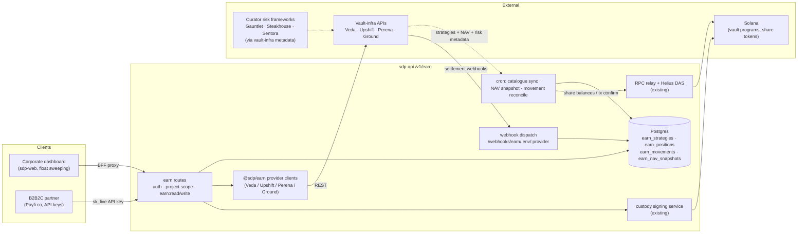
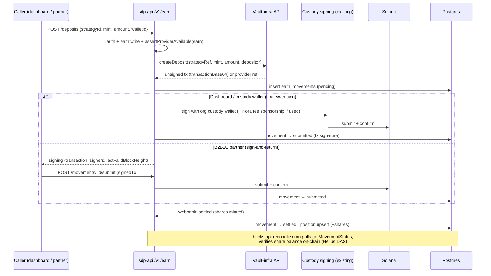

# Earn V1 — data flow & SDP reuse map

Companion to [ADR 0002](../decisions/0002-earn-provider-pluggability.md). The
scaffold on `earn-initial` shows the *shape*; this doc shows where every piece
of data comes from **in the real build**, and which existing SDP components
Earn rides on instead of rebuilding. Rule of thumb: **Earn adds a domain, not
a platform** — auth, tenancy, custody, signing, fees, RPC, webhooks, cron,
compliance, policies, and audit all already exist and are reused. For the
step-by-step of changing what Earn offers (provider / vault / category /
custodian), see the
[Earn pluggability playbook](../contributing/earn-pluggability-playbook.md).

## System context

```mermaid
flowchart LR
    subgraph Clients
        DASH["Corporate dashboard<br/>(sdp-web, float sweeping)"]
        PARTNER["B2B2C partner<br/>(Payfi co, API keys)"]
    end

    subgraph SDP["sdp-api  /v1/earn"]
        ROUTES["earn routes<br/>auth · project scope · earn:read/write"]
        SVC["@sdp/earn provider clients<br/>(Veda / Upshift / Perena / Ground)"]
        DB[("Postgres<br/>earn_strategies · earn_positions<br/>earn_movements · earn_nav_snapshots")]
        CRON["cron: catalogue sync ·<br/>NAV snapshot · movement reconcile"]
        WH["webhook dispatch<br/>/webhooks/earn/:env/:provider"]
        SIGN["custody signing service<br/>(existing)"]
        RPC["RPC relay + Helius DAS<br/>(existing)"]
    end

    subgraph External
        VAULT["Vault-infra APIs<br/>Veda · Upshift · Perena · Ground"]
        CHAIN["Solana<br/>(vault programs, share tokens)"]
        CURATOR["Curator risk frameworks<br/>Gauntlet · Steakhouse · Sentora<br/>(via vault-infra metadata)"]
    end

    DASH -->|BFF proxy| ROUTES
    PARTNER -->|sk_live API key| ROUTES
    ROUTES --> DB
    ROUTES --> SVC
    SVC -->|REST| VAULT
    VAULT -.->|strategies + NAV + risk metadata| CRON
    CURATOR -.-> VAULT
    CRON --> DB
    VAULT -->|settlement webhooks| WH
    WH --> DB
    ROUTES --> SIGN
    SIGN --> CHAIN
    RPC --> CHAIN
    CRON -->|share balances / tx confirm| RPC
```

## Where each surface gets its data (source of truth)

| Surface | Serving read | Fed by | Freshness |
|---|---|---|---|
| Strategy catalogue | `earn_strategies` (DB) | Cron sync ← provider `listStrategies` (curator/risk metadata rides along as `risk_metadata`); snapshots outside the client's `declaredSupport` are skipped fail-closed (`isStrategyWithinDeclaredSupport`, `@sdp/earn/support`) | Hourly (`cron/earn-catalogue-sync.ts`) |
| APY / NAV / TVL | `earn_nav_snapshots` (DB time series) | NAV cron ← provider `getNav` **and/or** on-chain share-price read via RPC relay (open decision below) | Cron cadence (e.g. 15m) |
| Positions | `earn_positions` (DB ledger) — **design only; no V1 writer, see callout** | Written by execution path; **verified** against on-chain share-token balances via Helius DAS / RPC (reconciliation cron) | Ledger = immediate; reconcile = cron |
| Deposits/withdrawals | `earn_movements` (DB ledger) — **design only; no V1 writer, see callout** | Execution endpoints write `pending`; settled via provider webhook (primary) + status-poll cron (backstop) — same ack-then-reconcile shape as ramps | Webhook ≈ real-time |
| Quotes (rate previews) | Live passthrough | Provider `quoteDeposit`/`quoteWithdrawal`, no DB | Real-time |
| Wallet balances (funding) | Existing wallet/custody surfaces | Existing RPC relay + token account reads — nothing Earn-specific | Existing behavior |
| Provider on/off state | `getProviderAvailability` (existing service, `earn` family already wired) | Org entitlements + env credentials | Real-time |

> **Ledger vs live — how it actually sits today (open, PRO-1628).** The two
> ledger rows above are the execution-era *design*, and **nothing in V1 writes
> them**. This is stranding, not ambiguity: the ledger's writer was the
> execution endpoints, and the portfolio-wallet model shipped without them
> (PRO-1634), so migration 0048's tables and the `/v1/earn/positions` +
> `/v1/earn/movements` routes serve **permanently empty ledgers** a partner
> could mistake for authoritative. The operative source of truth for anything
> money-shaped is the provider, live: `GET /v1/earn/program` reads positions
> and balances from the wallet snapshot per request, and withdrawals are
> created and polled directly against the provider with no SDP row (which is
> why the caller's idempotency key is the entire duplicate-defense on that
> path). PRO-1628 settles it — either wire the ledger from observed movements
> plus a reconcile cron, or stay live-only and remove/document the dead
> surface — and the decision lands as an ADR 0002 addendum. Whichever way,
> the provider remains the authority; a ledger would relay and reconcile
> provider truth, never replace it.

**No new indexer.** V1 needs no event-sourced chain indexer: catalogue and NAV
come from provider APIs (optionally cross-checked on-chain), and position truth
is the live provider snapshot today — or, should the ledger option win
PRO-1628, SDP's own ledger reconciled against token balances the existing
Helius DAS service can already read. If V2 needs richer on-chain history (per-block share
price, protocol events), that's the point to evaluate an indexer — not V1.

## Deposit execution (the real thing)

```mermaid
sequenceDiagram
    participant C as Caller (dashboard / partner)
    participant API as sdp-api /v1/earn
    participant P as Vault-infra API
    participant S as Custody signing (existing)
    participant SOL as Solana
    participant DB as Postgres

    C->>API: POST /deposits {strategyId, mint, amount, walletId}
    API->>API: auth + earn:write + assertProviderAvailable(earn)
    API->>P: createDeposit(strategyRef, mint, amount, depositor)
    P-->>API: unsigned tx (transactionBase64) or provider ref
    API->>DB: insert earn_movements (pending)
    alt Dashboard / custody wallet (float sweeping)
        API->>S: sign with org custody wallet (+ Kora fee sponsorship if used)
        S->>SOL: submit + confirm
        API->>DB: movement → submitted (tx signature)
    else B2B2C partner (sign-and-return)
        API-->>C: signing {transaction, signers, lastValidBlockHeight}
        C->>API: POST /movements/:id/submit {signedTx}
        API->>SOL: submit + confirm
        API->>DB: movement → submitted
    end
    P-->>API: webhook: settled (shares minted)
    API->>DB: movement → settled · position upsert (+shares)
    Note over API,DB: backstop: reconcile cron polls getMovementStatus,<br/>verifies share balance on-chain (Helius DAS)
```

Withdrawals mirror this with the liquidity-term fork: instant → same-loop
settlement; delayed → movement holds `redemption_available_at`, surfaces as a
pending redemption, settles on the provider's T+n webhook (or poll).

## Existing SDP we leverage (build ≠ rebuild)

| Existing component | Where | Earn uses it for | Status |
|---|---|---|---|
| Auth + API keys + permissions | `middleware/auth.ts`, `@sdp/types/permissions` | `earn:read`/`earn:write` gating, partner `sk_live` access | ✅ wired in scaffold |
| Org/project tenancy | `projectContextMiddleware` | Position/movement scoping | ✅ wired |
| Provider entitlements | `services/provider-availability.service.ts` | Per-org enable/disable (override-only: every org needs an explicit `providerOverrides.earn.<id>`), env kill-switch, exit-safe gate | ✅ wired (`earn` family) |
| Custody + signing | `services/domain/signing.service.ts`, `@sdp/custody` | Signing deposits/withdrawals from org wallets — full-signing custodians (Fireblocks, ...) work as-is; Anchorage is lifecycle-only today (playbook §5) | 🔨 execution phase — extend `SigningMetadata.operationType` (closed union at `packages/sdp-custody/src/signing.ts:99`) with earn ops |
| Fee sponsorship | `@sdp/payments/fee-payment` (Kora) | Sponsored fees on earn txs (same as payments) | 🔨 execution phase |
| RPC relay (org-selected providers) | `@sdp/rpc` (`packages/sdp-rpc/src/relay.ts`) | On-chain reads: share balances, tx confirmation, optional NAV cross-check | 🔨 NAV/reconcile phase |
| Helius DAS | `services/helius-das.service.ts` | Share-token balance reads for position reconciliation (the "indexer-lite") | 🔨 reconcile phase |
| Webhook dispatch + signature verify | `routes/webhooks/handlers.ts`, `lib/webhook-signature.ts` | Provider settlement events (`EarnSettlementEvent`, mirrors `RampSettlementEvent`) | 🔨 per-provider processors |
| Cron infra (3 entrypoints) | `cron/runner.ts`, `index.ts scheduled`, `job.ts`; precedent `cron/pending-transfers.ts` | Catalogue sync, NAV snapshots, movement reconciliation | ✅ catalogue sync (`cron/earn-catalogue-sync.ts`, hourly, gated on `isEarnEnabled` — `MARKETS_ENABLED` **and** `EARN_ENABLED`) · 🔨 NAV + reconcile tasks |
| Idempotency | `middleware/idempotency-key.ts` + `earn_movements.external_id` unique index | Partner-safe deposit/withdraw retries | ✅ schema ready |
| Compliance providers | `services/compliance/`, compliance family | RWA strategy KYC / depositor checks (open decision) | ⏸ decision pending |
| Policies + approvals | policy/approval domains (`policy.repository`, approvals UI) | Graft point for doc's risk tooling (whitelists, buffers, limits, timelocks, maker-checker) | ⏸ the audit's flagged gap — decide V1 vs later |
| Audit log | `services/audit.service.ts` | Deposit/withdraw/config audit events | 🔨 execution phase |
| Secrets/env plumbing | Doppler → `secret-keys.mjs` → workers | Provider API keys (already registered) | ✅ wired |
| OpenAPI → docs pipeline | `openapi/spec.ts` → sdp-docs | Public `/v1/earn` reference once the Markets/Earn flags flip | ⏸ deliberately deferred |

**Net-new (Earn-only) components:** the provider clients in `@sdp/earn`
(Ground is live — see below; the rest remain `StubEarnClient` subclasses
carrying `provider` + `declaredSupport`, filled in method-by-method), the
portfolio-wallet capability (`EarnPortfolioWalletProvider` +
`supportsPortfolioWallets` in `@sdp/earn/capabilities`), the
`earn_provider_wallets` table (migration `0049`, one shared wallet per
org+environment+provider — SDP's model, not a provider limit: one provider
account holds many wallets, one per org), the catalogue-sync cron
(`cron/earn-catalogue-sync.ts`) + dev seed (`db:seed:earn` →
`scripts/seed-earn-demo.ts`), the NAV cron task, earn webhook processors, and
the execution endpoints + `/movements/:id/submit`.

## Ground — the first live provider (portfolio-wallet flow)

The dashboard's mock seam (`earn-mock-data.ts`) is replaced by a live path
built on `GroundEarnClient` (`@sdp/earn/providers/ground/client`), which
implements `EarnPortfolioWalletProvider`. Auth is a Bearer key from env
(`GROUND_SANDBOX_API_KEY` / `GROUND_API_KEY`); a missing key fails closed
with `PROVIDER_NOT_CONFIGURED` before any request leaves the process.

```mermaid
flowchart LR
    GY["Ground GET /v2/wallets/yield-sources"] -->|hourly cron| SYNC["earn-catalogue-sync"]
    SYNC -->|declared-support validated| ES[("earn_strategies")]
    ES --> CAT["GET /v1/earn/strategies"]

    PROG["PUT/GET /v1/earn/program"] --> EPW[("earn_provider_wallets")]
    PROG -->|create wallet / update strategy / snapshot| GW["Ground /v2/wallets"]

    FUND["Solana deposit address<br/>(from wallet snapshot)"] -.->|user sends USDC| GW
    GW -->|GET deposits (poll)| DEP["deposit tracking"]

    WD["portfolio withdrawal<br/>(amountUsd + token + solana dest)"] --> GW
```

- **Catalogue.** Cron calls Ground's cursor-paginated
  `GET /v2/wallets/yield-sources`; each source maps to a strategy snapshot
  (apyBps→decimal, redeem policy→instant/delayed, curator derived from known
  ids → `morpho-<curator>-<token>` convention → protocol fallback,
  dominant-allocation rwa/defi classification, tvl/utilization into
  `riskMetadata`). Four gates drop a source before it can be catalogued, in
  that order (`distillGroundYieldSource`): `mode !== "active"` — `buy_only`
  would take deposits into an exit-frozen source and `sell_only`/
  `emergency_freeze` cannot take deposits at all; a deposit token Ground does
  not route on Solana (`GROUND_SOLANA_ROUTED_TOKENS` is USDC only), which is
  un-fundable and un-exitable through SDP's Solana-only surface on *every*
  cluster; an unrecognized token symbol; and no well-known mint on this
  environment's cluster. Routability is the gate that actually bites: all 3 of
  sandbox's 18 sources that never reach the catalogue are dropped
  `not_solana_routable` — USDT twins of vaults already catalogued in USDC
  (`docs/earn/ground-catalogue-inventory.md`). Rows land in `earn_strategies`
  via the standard sync.
- **Program (shared wallet).** One Ground wallet per org+environment,
  recorded in `earn_provider_wallets`. First strategy selection creates the
  wallet (`POST /v2/wallets`, idempotent via UUIDv4 requestId, polled from
  `creating` to `ready`); later selections replace the strategy
  (`PATCH /v2/wallets/{id}/strategy`). A selection is exactly ONE strategy at
  `pct: 100` of that strategy's stablecoin lane (`singleStrategyAllocation`);
  the curator-first step and the weight editor were removed on purpose —
  curator is metadata rendered beside a strategy, never a gate — and an
  omitted lane keeps its current allocation server-side. Positions and
  balances are read live from the wallet snapshot and rendered as a flat
  value-ordered holdings list, not grouped by curator — no SDP-side position
  ledger for the portfolio surface.
- **Funding.** The wallet snapshot exposes its Solana deposit address
  (`solana_devnet` sandbox / `solana` production); users fund by sending
  USDC there — Ground's Solana rails carry USDC only
  (`GROUND_SOLANA_ROUTED_TOKENS`), with USDT riding Ethereum (mainnet in
  production, Sepolia in sandbox), so the funding lane and the payout lane
  (`assertSolanaRoutable`) agree on one stablecoin. Deposits are tracked via
  Ground's cursor-paginated deposits API. No custody signing in V1.
- **Withdrawals.** Portfolio-level: preview
  (`POST .../withdrawal-preview`) then create
  (`POST .../withdrawals`, caller-owned requestId — a 409
  `request_id_conflict` surfaces as `CONFLICT`), pinned to the environment's
  Solana rail, then status-polled over `EARN_PORTFOLIO_WITHDRAWAL_STATUSES`
  (`@sdp/types/earn`): `processing`, `pending_approval`, `completed`,
  `partially_completed`, `failed`, `cancelled`. `pending_approval` is
  SDP-derived, not a Ground status — Ground leaves the withdrawal at
  `processing` while a payout leg (or a step inside it) sits in
  `pending_customer_approval` awaiting the customer's Turnkey stamp, so
  `mapWithdrawal` folds that up into the distinct wire status rather than
  leaving a blocked exit indistinguishable from one in flight. It never
  overrides a terminal status: once a withdrawal settles, leg states are
  history. Destination whitelisting is available as an explicit address-book
  call, not folded into the withdrawal flow.
- **Settlement signal: polling, for now.** Ground offers Stripe-style
  HMAC-signed webhooks; wiring them into the existing webhook dispatch is
  future work — V1 polls deposit and withdrawal status.

## Open infra decisions (mirror of the V1 decision list)

1. **NAV source of truth** — provider API (simple, trusts partner) vs on-chain
   share-price read via RPC relay (trustless, needs per-vault program
   knowledge) vs both with drift alerting. Cadence + retention for snapshots.
2. **Settlement signal** — webhook-primary with poll backstop (ramps pattern,
   assumed above) vs poll-only for providers without webhooks. *Resolved for
   Ground V1: poll-only; its HMAC webhooks are future work (see above).*
3. **Compliance hook** — do RWA deposits require a compliance-provider check
   (Genius-compliant tokens need app whitelisting — JOLT/B-reserves)?
4. **Policy engine scope** — which of whitelist/buffer/limits/timelocks land in
   V1, and whether they graft onto the existing policy/approvals domain.
