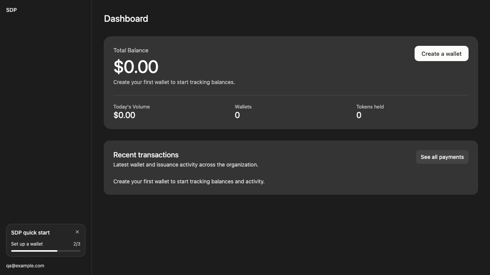
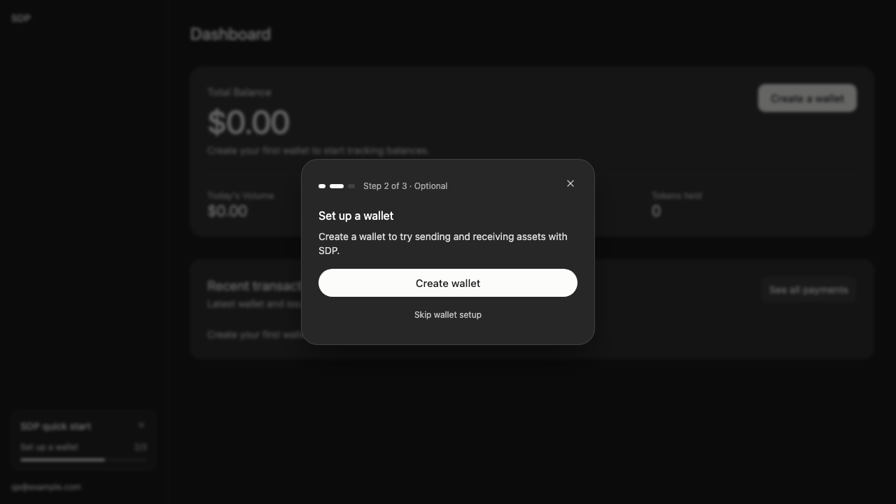
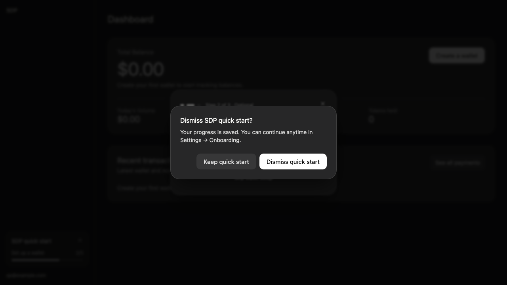
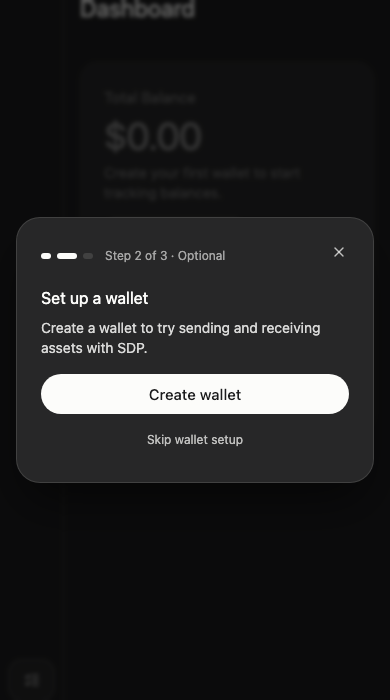
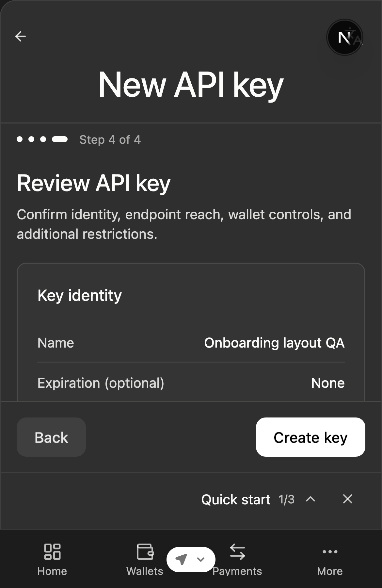

# Dashboard quick start QA

The current guide is a compact sidebar card immediately above the account/email menu, on both desktop and the mobile navigation drawer. It shows the current step and progress and opens the guide on click. Both the expanded guide's X and the sidebar card's X ask for confirmation before hiding the guide, with a reminder that it can be resumed in Settings → Onboarding. Cancel returns to the current step without changing progress. Escape or following the step's action still minimizes the guide. A collapsed desktop sidebar uses an icon launcher. The guide no longer opens automatically or occupies a form-footer row.

## Review follow-up and simplification — September 10

- Synced the branch with main. Next.js checks existing API-key records after ruling out wallets. An organization with an API key starts at wallet setup and retains its normal balance panel on a fresh browser; failed key lookups do not classify it as new. Wallet setup or explicit dismissal still hides the guide.
- Separated the sidebar launcher markup from guide state, combined identical action-close callbacks, and reused monotonic progress updates for creation completion.
- All 52 focused guide, storage, eligibility, home, and loading tests passed. Web typecheck, scoped Biome, and module boundaries passed.
- Browser checks used the real guide and home components with synthetic workspace data in an isolated fixture. Verified the existing-key balance panel, step 2, dark-mode confirmation, and collapsed-sidebar dismissal at 1280 × 720 and 390 × 700.

## Dark-mode separation — September 10

- The guide and dismissal confirmation use the existing darker panel surface in dark mode, with a stronger shadow and a 60% black, lightly blurred backdrop. Light mode retains the existing surface and backdrop.
- Visually checked both dialogs with the actual component and application CSS at 1280 × 720 in both themes, plus 390 × 700 in dark mode. The confirmation stays distinct above the guide, and cancel returns focus to the guide’s X.
- All 17 guide tests passed, along with web typecheck, scoped Biome, and module-boundary checks. The isolated fixture used synthetic workspace data.

## Expanded guide layout — September 10

- Removed the visible SDP quick start label inside the guide. The dialog retains its accessible name.
- Reused `WizardStepProgress` from the counterparty form, replacing the full-width progress bar with segmented step indicators and the step count in the header.
- Removed Continue later. The guide’s single X uses the same dismissal confirmation as the sidebar card, including in collapsed navigation and when opened from Settings.
- Verified the actual component in dark mode at desktop width and 390 × 700, including the optional wallet step, cancel returning focus to the guide’s X, confirmed dismissal across reload, and resuming the saved step from Settings. All 28 focused guide, storage, and home tests passed; web typecheck, Biome, module boundaries, and diff checks passed.

## Dismissal and Settings verification — September 10

- Settings has an Onboarding section with the saved step and a Continue quick start action. Resuming restores the sidebar card and opens the guide at the saved step. Older previews that stored dismissal as completion can restart explicitly from Settings. Existing organization setup still suppresses the guide.
- Checked the actual component and application CSS in an isolated browser fixture at 1280 × 720 and 390 × 700. Verified the confirmation, dismissal across reload, recovery from Settings at step 2, and minimizing with focus returning to the Settings button. Both new surfaces fit the narrow viewport.
- 61 focused tests passed for dismissal/cancel, Settings recovery, browser persistence, storage failure, cross-tab updates, organization eligibility, home state, loading layouts, and i18n. Web typecheck, scoped Biome checks, module boundaries, and diff checks passed.
- Workspace and account data were synthetic. No live API key, wallet, or transaction was created.

## Sidebar card verification — September 10

- Rendered the actual quick-start component with the application's CSS in an isolated local fixture.
- Visually checked the expanded sidebar at 1280 × 720, the collapsed sidebar, and a narrow sidebar at 390 × 600. The card remains above the account menu without covering the form footer.
- Opened the guide from the card and returned to the form, verifying keyboard focus returns to the launcher.
- 26 focused tests passed, covering the sidebar launcher, collapsed mode, navigation, dismissal, browser persistence, home state, and shell loading states. Web typecheck, scoped Biome checks, and module boundaries passed.
- Fixture workspace and account data were synthetic; no live API key, wallet, or transaction was created.

## Earlier walkthrough

Local Zen walkthrough on September 9, 2026, using the branch web server on port 3103 and API on port 8791. The screenshot below records the former form-footer placement and is retained as historical QA evidence.

## Browser checks

- API-key creation: all four steps reached; Continue and Create key remain unobstructed.
- Mobile (390 × 600): form actions, guide row, and bottom navigation do not overlap.
- Opening and closing the guide preserves the form and returns keyboard focus to its launcher.
- Wallet handoff: provider selection and wallet details reached; Next and Create wallet remain unobstructed.
- Optional wallet skip reaches the USDC faucet step without requiring wallet creation.

No API key or wallet was created, and no faucet transaction was submitted. The Mac locked before the final completed-dashboard refresh could be visually checked.

## Automated coverage

Focused tests cover initial modal/minimization, navigation without premature completion, dismissal, completion from successful creation, completed and unknown server states, user/organization isolation, dismissal across projects, disabled custody, unavailable browser storage, cross-tab dismissal, bounded sync polling, access failures, and progress that cannot move backward.

September 10 verification: 50 focused web tests passed, along with the web typecheck, scoped Biome checks, and module-boundary generation/check. The browser screenshots above predate the persistence refactor; wallet-based suppression and browser persistence were verified with automated tests.

## Web-only eligibility and persistence

The guide uses existing organization state: legacy completion, a configured default custody wallet, or any wallet in an accessible project suppresses it. Wallet checks include all providers and omit balances. Unknown organization or wallet state does not show the guide. When no wallets exist, existing API-key records seed the wallet step and preserve the normal balance panel. Only organizations with no wallets or API-key records start at API-key creation; an unavailable key list does not count as empty. Creating a wallet also dismisses the guide immediately; skipping wallet setup still leads to the test USDC faucet.

Progress and dismissal live separately in browser storage, scoped to the user and organization, so hiding the guide preserves the current step and changing projects does not reopen it. Settings → Onboarding can clear dismissal and resume progress. Dismissal is not shared with teammates or other browsers and resets when browser data is cleared. Existing wallets still suppress the guide on a new device.

No SDP API changes, organization-settings writes, shared-type changes, or database migrations are required.

The unsynced and already-onboarded scenarios were checked with deterministic tests, not new live Clerk organizations.
