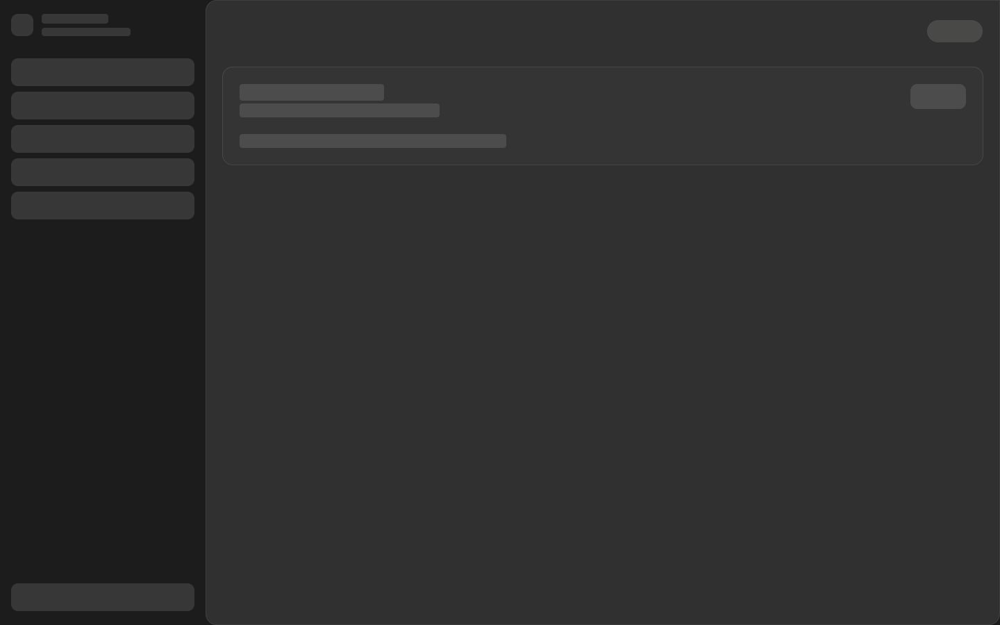
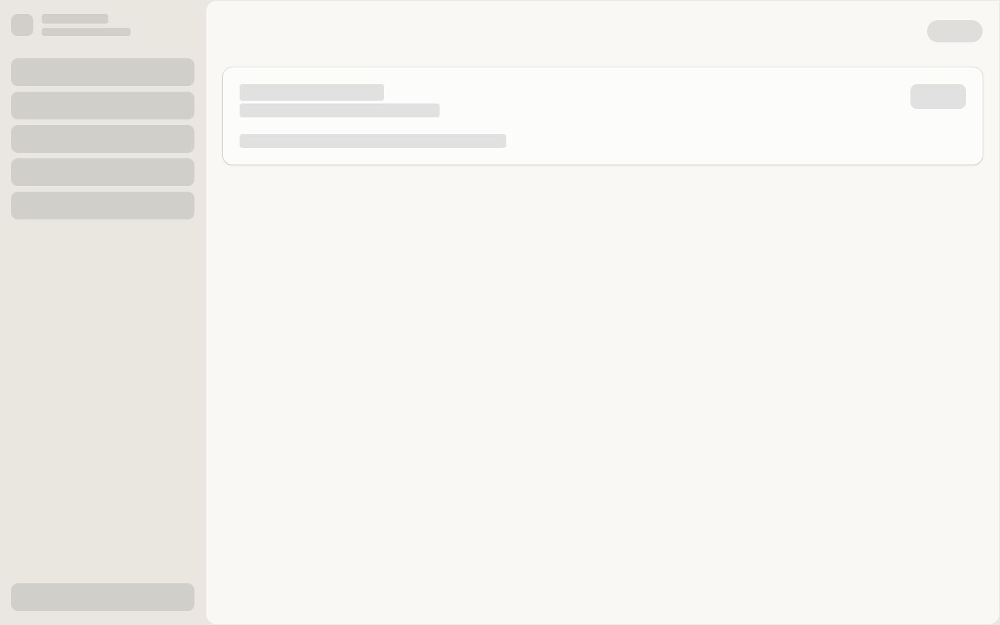
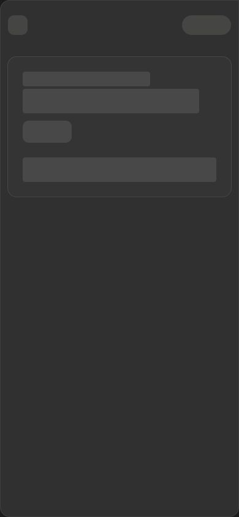

# Organization setup loading

Local visual QA uses the production loading components, Home content, design tokens,
and English copy in an isolated Vite harness. Workspace identity and Home data are
stubbed to an empty sandbox organization; no live signup or webhook delivery is
claimed by these screenshots.

- Desktop: 1440 × 900, light and dark themes.
- Mobile: 390 × 844, dark theme.
- No horizontal overflow at either viewport.
- The compact loading card and settled empty Home card share bounds:
  desktop x=321, y=97, width=1094, height=140; mobile x=13, y=93,
  width=364, height=228. The comparison uses the same loading chrome to isolate
  the page-content transition.
- Unit coverage checks identical preparation/auth frames, deep-link skeletons,
  collapsed-sidebar width, client navigation without restarting Clerk, bounded
  polling/retry, and Home dismissal/completion behavior.

Organization preparation cannot know the final Home layout before the workspace
is ready. It uses the destination's standard skeleton; once server state confirms
a new sandbox organization, Home uses the compact skeleton. Existing organizations
keep the balance and activity skeleton.

